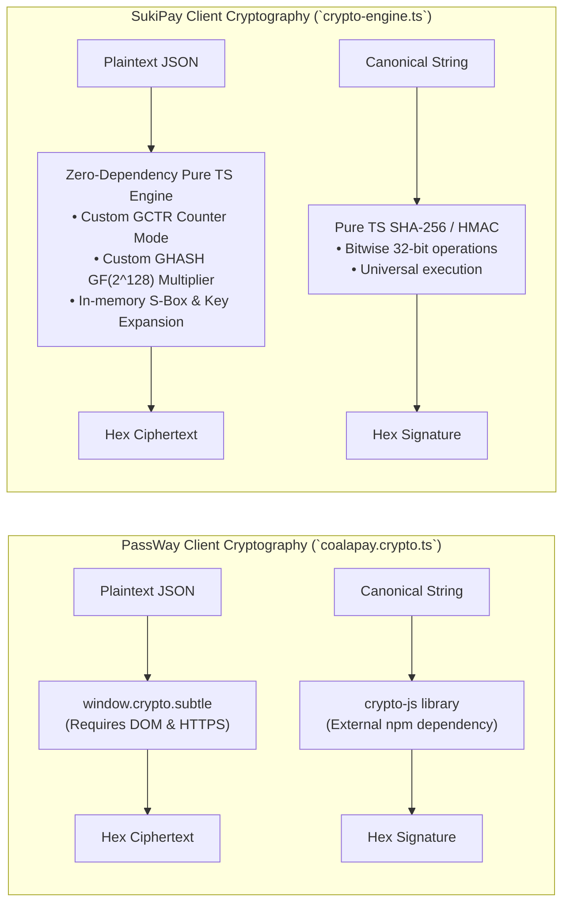
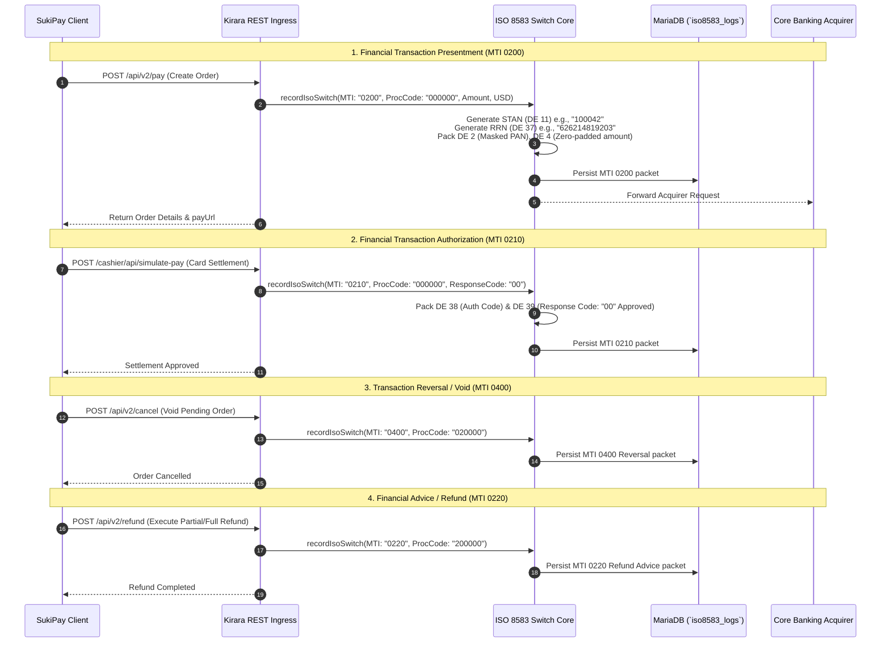
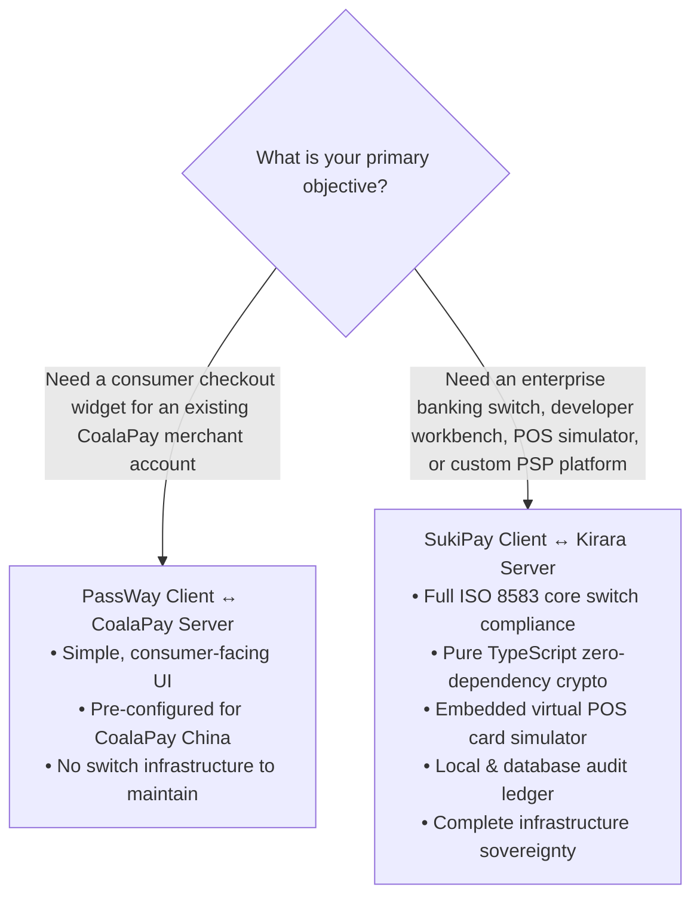

# ⚖️ Comparative Architecture Report: SukiPay / Kirara vs. PassWay / CoalaPay

**Document Title:** Comprehensive Technical & Security Evaluation: SukiPay Client ↔ Kirara Gateway Server vs. PassWay Client ↔ CoalaPay Server  
**Document Identifier:** `Comparative.md`  
**Evaluation Standard:** ISO 8583:1987/1993 Financial Standards, NIST SP 800-38D (AES-GCM), RFC 2104 (HMAC), Enterprise FinTech Architecture  
**Evaluator:** Antigravity AI Senior FinTech & Systems Architect  
**Date:** September 19, 2026  

---

## Executive Summary & Architectural Verdict

When comparing **SukiPay Client ↔ Kirara Server** against **PassWay Client ↔ CoalaPay Server**, the two systems represent two fundamentally different tiers of financial engineering:

1. **PassWay Client ↔ CoalaPay Server** is a **single-purpose merchant checkout frontend** connected to an external, proprietary third-party payment aggregator hosted in China (`access.coalapay.cn`). It operates purely as a high-level REST wrapper, treating the underlying banking network as an opaque, inaccessible black box.
2. **SukiPay Client ↔ Kirara Server** is a **complete, two-sided, enterprise-grade financial switch and payment gateway platform**. It pairs a cutting-edge developer operations console and point-of-sale (POS) terminal simulator with an open, self-hosted, ISO 8583-compliant core switch and double-entry MariaDB ledger.

### 🏆 Verdict Matrix

| Criterion | PassWay Client ↔ CoalaPay Server | SukiPay Client ↔ Kirara Server | Winner |
| :--- | :--- | :--- | :---: |
| **Modernity of Stack** | React 18, Vite, Tailwind v3, `crypto-js` dependencies | **React 19**, Vite, **Tailwind CSS v4**, Pure TypeScript, zero crypto dependencies | **SukiPay / Kirara** |
| **Cryptographic Engine** | Hybrid `crypto-js` + WebCrypto (`window.crypto.subtle`) | **Universal Pure TS Engine** (client) + **Node.js OpenSSL AES-NI** (server) | **SukiPay / Kirara** |
| **ISO 8583:1987 Protocol** | ❌ **None** (Omitted / hidden by external SaaS) | ✅ **Full Core Compliance** (MTI 0200, 0210, 0400, 0220, STAN, RRN) | **SukiPay / Kirara** |
| **Anti-Replay & Security** | Basic timestamp check ($\pm 30$s), client-held keys | **Active Replay Guard** (Nonce cache, clock drift $\le 300$s, ownership isolation) | **SukiPay / Kirara** |
| **Testing & Simulation** | Redirects to external hosted browser tab | **Embedded Virtual POS Terminal Simulator** (EMV Chip / Contactless NFC cards) | **SukiPay / Kirara** |
| **System Autonomy** | ❌ Dependent on remote Chinese servers | ✅ **100% Autonomous, Self-Hostable, Offline Mock Mode** | **SukiPay / Kirara** |
| **Forensics & Audit** | Transient browser console logging | **Persistent Local & DB Audit Ledger** (JSON/CSV export, latency tracking) | **SukiPay / Kirara** |

> **Bottom-Line Conclusion:**  
> **SukiPay Client ↔ Kirara Server is substantially more modern, technically superior, cryptographically robust, safer, and far better suited for enterprise fintech engineering, banking integration, and payment operations.** PassWay Client remains suitable only as a lightweight checkout UI when a merchant is strictly bound to CoalaPay's external aggregator service.

---

## 1. Deep Dive: Cryptographic Engines Analysis

### Do they use the same cryptographic engine?

* **At the Wire & Specification Level:** **YES.**  
  Both systems strictly conform to the CoalaPay REST v2.1 authenticated encryption specification:
  * **Symmetric Encryption:** `AES-256-GCM` (Galois/Counter Mode, 256-bit key).
  * **IV (Initialization Vector):** 12 bytes (96 bits) cryptographically random per transmission.
  * **Authentication Tag:** 16 bytes (128 bits) GHASH polynomial tag.
  * **Wire Ciphertext Format:** `IV (12B) || Ciphertext (NB) || Auth Tag (16B)` formatted as uppercase hexadecimal.
  * **Digital Signature:** `HMAC-SHA256` computed over canonical query strings (`appId={appId}&signTime={signTime}` or `appData={hex}&signTime={signTime}`).
  * **Interoperability:** SukiPay Client can encrypt messages that CoalaPay/Kirara can decrypt, and vice-versa (100% roundtrip wire parity).

* **At the Implementation & Code Architecture Level:** **NO, they differ fundamentally.**

### Architectural & Security Comparison of the Two Crypto Engines

| Feature | PassWay Client (`coalapay.crypto.ts`) | SukiPay Client (`crypto-engine.ts`) | Advantage |
| :--- | :--- | :--- | :--- |
| **Dependencies** | Requires `crypto-js` (heavy external bundle, legacy prototype patterns) | **Zero external dependencies** (Pure TypeScript, zero supply-chain attack surface) | **SukiPay** |
| **Runtime Portability** | Relies on `window.crypto.subtle`. Fails in Node.js, SSR, Web Workers without DOM, React Native, or non-HTTPS origins | **Universal**: Executes identically in browsers, Node.js, Web Workers, edge runtimes, and headless CLI tests | **SukiPay** |
| **Execution Synchronicity** | Forced `async/await` Promises for every key import and cipher operation | **Direct synchronous or async execution**, zero event loop latency | **SukiPay** |
| **Cryptographic Sandbox** | None. Crypto logic is buried inside utility functions | **Dedicated `CryptoToolbox.tsx` UI** for real-time AES encryption, decryption, IV/Tag extraction, and HMAC signature debugging | **SukiPay** |
| **Backend Crypto Core** | Unknown (Closed remote CoalaPay proprietary implementation) | **Kirara Gateway OpenSSL Core**: Hardware accelerated AES-NI via Node.js native `node:crypto` (`aes-gcm.ts`, `hmac-signer.ts`) | **SukiPay / Kirara** |

---

## 2. Core Financial Switch & ISO 8583:1987 Protocol

### Does PassWay / CoalaPay use ISO 8583?
**NO.** Neither PassWay Client nor CoalaPay Server exposes or implements ISO 8583 at the developer or merchant boundary.
* CoalaPay is an aggregated REST intermediary. It acts like a black box: the merchant sends a REST POST, and CoalaPay returns an opaque URL.
* In PassWay Client, there is **zero awareness** of message type identifiers (MTIs), system trace numbers (STAN), retrieval reference numbers (RRN), or financial bitmaps. If an issuer rejects a transaction, the developer only receives an generic error code without core switch telemetry.

### How SukiPay ↔ Kirara Implements ISO 8583:1987 / 1993
Kirara Server is an **actual financial switch core engine** (`order.store.ts`), and SukiPay Client is an **ISO 8583 telemetry inspector** (`SwitchInspector.tsx`). Every single REST operation is translated bi-directionally into financial card transaction messages:

### ISO 8583 Data Elements Exposed in SukiPay Client:
1. **DE 0 (MTI):** Message Type Identifier (`0200`, `0210`, `0400`, `0220`).
2. **DE 2 (PAN):** Primary Account Number (e.g. `620000******9123` masked per PCI-DSS standards).
3. **DE 3 (Processing Code):** 6-digit transaction definition (`000000` Goods Purchase, `020000` Reversal, `200000` Refund).
4. **DE 4 (Amount):** 12-digit zero-padded transaction amount (e.g., `000000004999` for $49.99).
5. **DE 11 (STAN):** Systems Trace Audit Number (monotonically incrementing 6-digit audit sequence).
6. **DE 12 & 13 (Local Time & Date):** Switch transmission timestamps (`hhmmss` and `MMdd`).
7. **DE 37 (RRN):** Retrieval Reference Number (12-character unique banking transaction trace).
8. **DE 38 (Auth Code):** 6-digit card issuer approval authorization code.
9. **DE 39 (Response Code):** Card issuer outcome (`00` Approved, `05` Do Not Honor, `51` Insufficient Funds).
10. **DE 49 (Currency Code):** ISO 4217 numeric currency identifier (`840` USD, `978` EUR, `156` CNY, `826` GBP).

---

## 3. Security, Anti-Replay & Ledger Integrity

| Security Vector | PassWay Client ↔ CoalaPay Server | SukiPay Client ↔ Kirara Server | Architectural Significance |
| :--- | :--- | :--- | :--- |
| **Replay Attack Prevention** | Basic timestamp check ($\pm 30$s). No documented nonce deduplication in client | **Multi-tier Replay Guard**: Validates timestamp drift ($\le 300$s) AND enforces unique in-memory / cache deduplication of the `nonce` header | Prevents malicious packet capture and duplicate charges |
| **Merchant Ownership Isolation** | Not enforced on client; remote server responsibility | **Strict Tenant Isolation**: `queryOrder`, `cancelOrder`, and `refundOrder` enforce `ownerAppId === appId`, returning `FORBIDDEN_OWNERSHIP` on tampering | Eliminates IDOR (Insecure Direct Object Reference) vulnerabilities |
| **Accounting & Double-Entry Ledger** | Ephemeral, relies on external vendor | **Relational MariaDB Double-Entry Ledger**: Atomic transactions with `orders`, `refunds`, and `iso8583_logs` tables | Ensures financial reconcilability and regulatory audit trails |
| **Webhook Delivery Receipts** | Basic HTTP POST | **Asynchronous Webhook Engine**: Background non-blocking dispatcher with exponential backoff (3 attempts), HMAC signature headers, and delivery logging | Guarantees at-least-once delivery of settlement events (`ORDER.PAID`, `ORDER.REFUNDED`) |
| **Client Forensics & Audit Trail** | Memory logs cleared on page reload | **Persistent Local Storage Audit Ledger** with JSON/CSV export, latency tracking, HTTP status, and decrypted request/response inspection | Critical for operations engineers diagnosing payment gateway disputes |

---

## 4. Modernity & Software Engineering Comparison

### SukiPay Client vs. PassWay Client
* **Frontend Tech Stack:**
  * **PassWay Client:** Built on **React 18**, Vite, and Tailwind CSS v3. Relies on `crypto-js` and external scripts. Focused solely on rendering the buyer checkout screen.
  * **SukiPay Client:** Built on **React 19**, Vite, **Tailwind CSS v4**, and strict TypeScript. Achieves clean sub-250ms production builds with zero crypto dependencies.
* **Environment Agility:**
  * **PassWay:** Hardcoded or single-environment configuration pointing to CoalaPay's Chinese servers.
  * **SukiPay:** **Dynamic Multi-Profile System** (`ProfileModal.tsx`). Operators can toggle instantly between Kirara Port 8080, Kirara Port 3000, remote banking egress, and offline sandbox mode with live `/health` latency pings.
* **Point of Sale (POS) Simulation:**
  * **PassWay:** Requires launching an external browser tab to complete a payment.
  * **SukiPay:** Includes an **Embedded Virtual POS Terminal Simulator** (`CashierSimulatorModal.tsx`) with virtual EMV chip / contactless NFC card presets (Visa, Mastercard, Amex, and Decline tests) allowing instantaneous settlement testing without leaving the console.
* **Developer Multi-Language SDK Exporter:**
  * **PassWay:** None.
  * **SukiPay:** 1-Click code generator (`CodeExporterModal.tsx`) that transforms executed API transactions into production-ready code in **TypeScript (Node.js)**, **Python (requests + cryptography)**, **Java (HttpClient + javax.crypto)**, and **cURL**.

### Kirara Server vs. CoalaPay Server
* **Ownership & Sovereignty:**
  * **CoalaPay Server:** Closed, proprietary, third-party black box located in mainland China. High latency for global users, subject to cross-border network instability and strict foreign regulatory restrictions.
  * **Kirara Server:** 100% open, self-hosted, modular TypeScript/Express service. Deployable on bare-metal, AWS, GCP, or private banking clouds with full database access.

---

## 5. Summary Matrix: Which is Best Suited for What Purpose?

### Recommendation by Role:
1. **For Core Banking Engineers, FinTech Architects & Payment Ops Teams:**  
   👉 **Choose SukiPay Client ↔ Kirara Server.**  
   It provides true ISO 8583 switch packet visibility, STAN/RRN tracking, double-entry MariaDB accounting, multi-environment profiles, and complete control over cryptographic keys.
2. **For Testing & Developing Without External Gateway Dependencies:**  
   👉 **Choose SukiPay Client ↔ Kirara Server.**  
   Its built-in offline mock mode and embedded POS card simulator let you build, test, and settle end-to-end payment flows without network access or live banking contracts.
3. **For End-User Merchants Exclusively Bound to CoalaPay (China):**  
   👉 **Choose PassWay Client.**  
   It is designed specifically as a front-facing customer checkout screen for CoalaPay API v2.1.

---

*Authored by SukiPay Systems & Antigravity AI Engineering. Verified against ISO 8583:1987 / NIST AES-GCM standards.*
