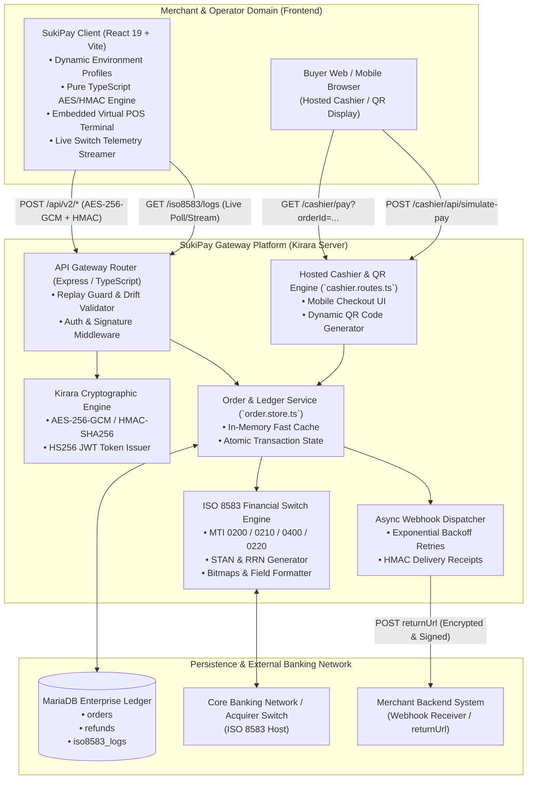
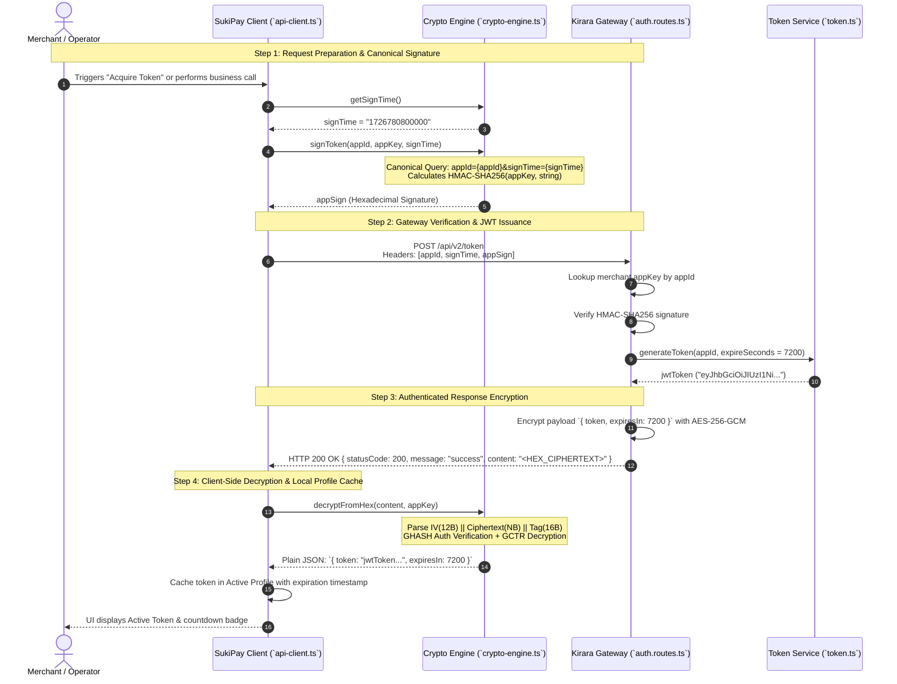
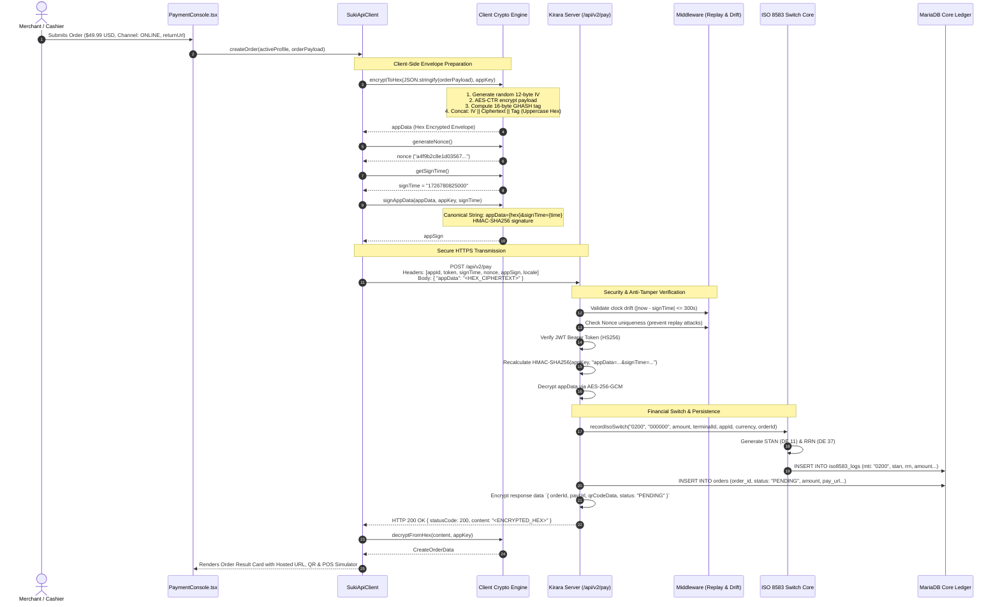
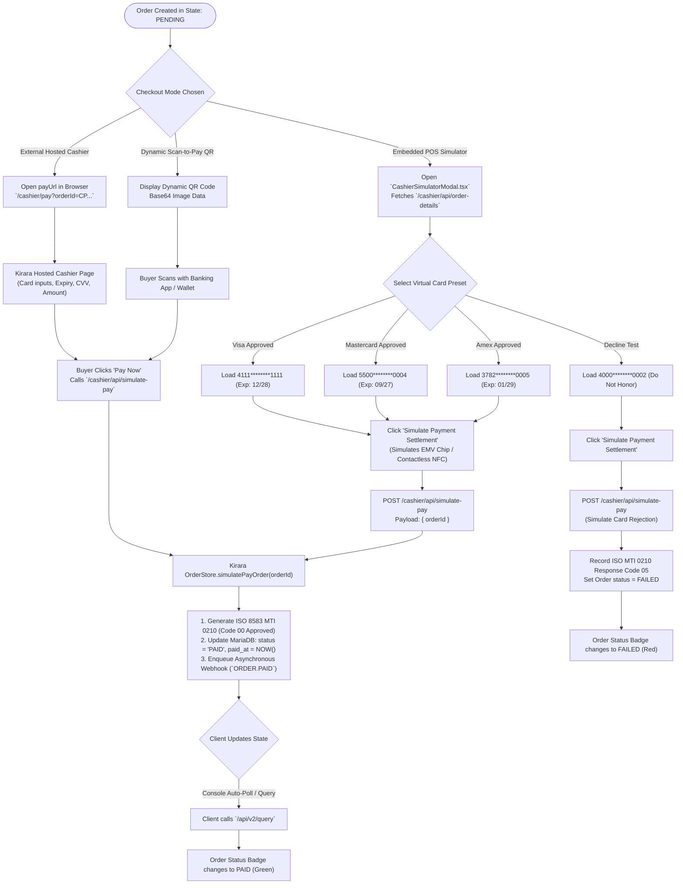
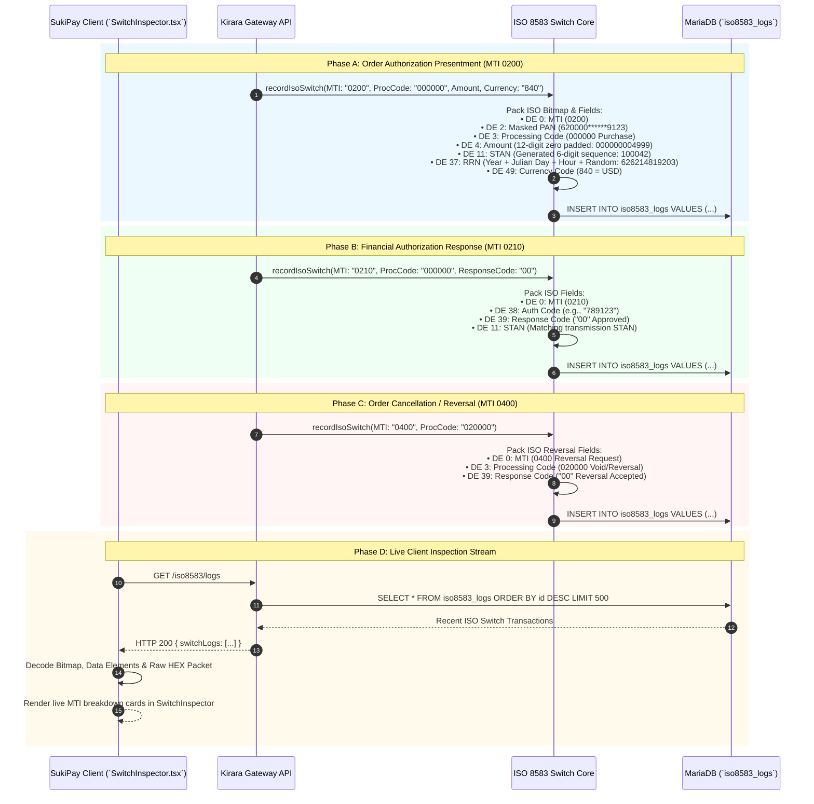
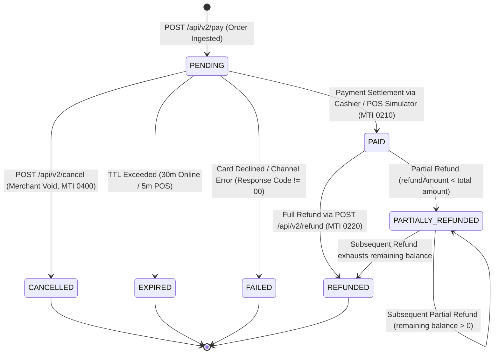
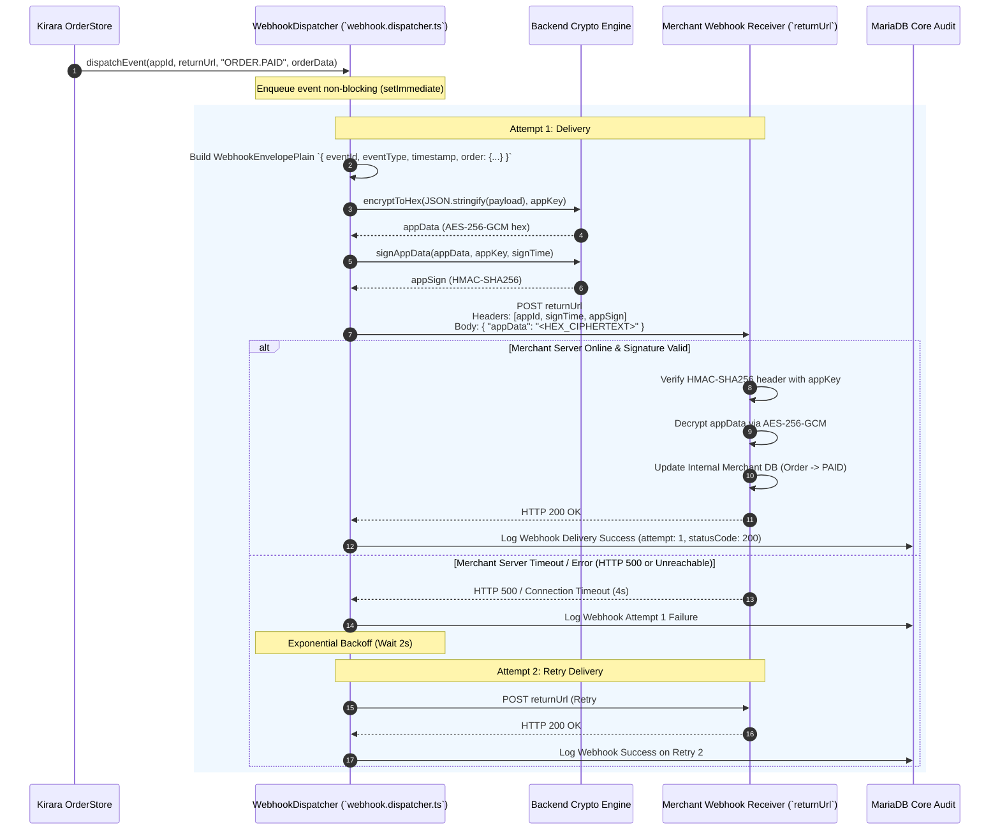
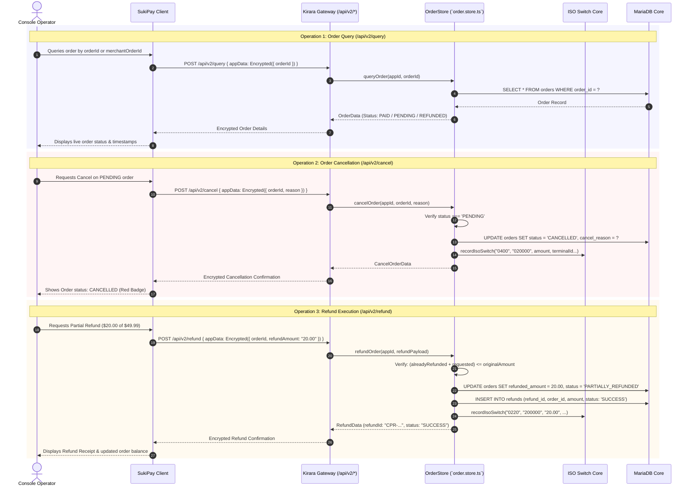
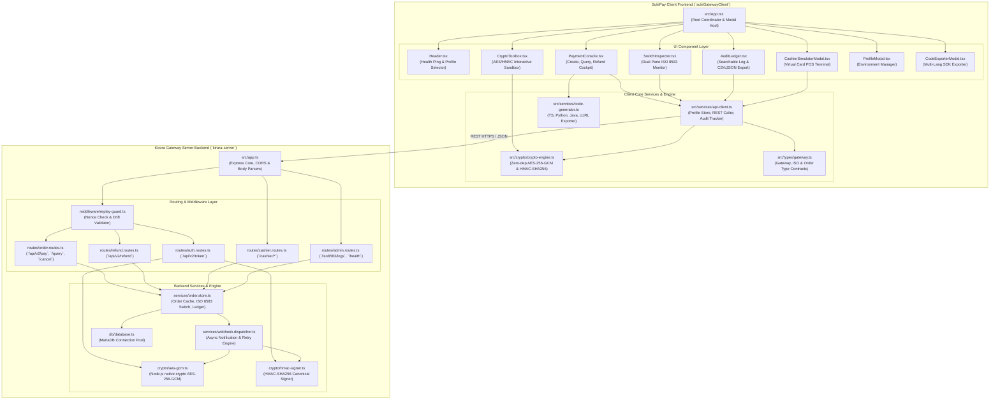

# 📊 Architectural & Sequence Diagrams — SukiPay Client ↔ Kirara Gateway Server

This document delivers an in-depth architectural blueprint and Mermaid sequence diagrams detailing the end-to-end interactions between **SukiPay Client** (`sukiGatewayClient`) and **Kirara Gateway Server** (`kirara-server`). 

It covers client-side authenticated cryptography (**AES-256-GCM** and **HMAC-SHA256**), token handshakes, order lifecycle management, **ISO 8583 financial switch message translation** (MTI 0200, 0210, 0400, 0220), hosted cashier vs. embedded POS terminal checkout, and asynchronous webhook delivery.

---

## 📑 Table of Contents

1. [High-Level Ecosystem Architecture](#1-high-level-ecosystem-architecture)
2. [Authentication & JWT Token Handshake Flow](#2-authentication--jwt-token-handshake-flow)
3. [Secure Order Ingestion & Cryptographic Wire Protocol](#3-secure-order-ingestion--cryptographic-wire-protocol)
4. [Dual Checkout Experience: Hosted Cashier, QR & Embedded POS Simulator](#4-dual-checkout-experience-hosted-cashier-qr--embedded-pos-simulator)
5. [ISO 8583 Core Financial Switch Translation & Live Telemetry](#5-iso-8583-core-financial-switch-translation--live-telemetry)
6. [Complete Order & Refund Lifecycle State Machine](#6-complete-order--refund-lifecycle-state-machine)
7. [Asynchronous Webhook Notification & Retry Engine](#7-asynchronous-webhook-notification--retry-engine)
8. [Order Inquiry, Cancellation & Multi-Tier Refund Operations](#8-order-inquiry-cancellation--multi-tier-refund-operations)
9. [Component & Layered System Architecture](#9-component--layered-system-architecture)

---

## 1. High-Level Ecosystem Architecture

The SukiPay ecosystem bridges modern REST web and mobile applications with traditional ISO 8583 core financial banking switches.

---

## 2. Authentication & JWT Token Handshake Flow

All transactional operations require a time-bounded HS256 JWT access token issued via `/api/v2/token`. The request and response utilize client-side HMAC signature verification and AES-256-GCM envelope encryption.

---

## 3. Secure Order Ingestion & Cryptographic Wire Protocol

The `/api/v2/pay` endpoint creates an order within Kirara Gateway. It enforces strict Replay Guard defenses, validates signatures, decrypts order metadata, logs an ISO 8583 presentment request (MTI 0200), and registers the transaction in MariaDB.

---

## 4. Dual Checkout Experience: Hosted Cashier, QR & Embedded POS Simulator

Once an order is created with status `PENDING`, SukiPay offers two distinct buyer completion pathways: the external hosted web cashier/QR scan or the zero-latency embedded POS Buyer Terminal Simulator.

---

## 5. ISO 8583 Core Financial Switch Translation & Live Telemetry

Every financial event in SukiPay is translated into standard **ISO 8583:1987/1993 Financial Transaction Card Originated Messages**. The dual-pane `SwitchInspector.tsx` monitors this telemetry in real time.

---

## 6. Complete Order & Refund Lifecycle State Machine

An order moves through strict finite states with full support for partial and multi-stage refunds.

### State Definitions:
* **`PENDING`**: Order initialized, payment URL and QR generated, awaiting cardholder presentment.
* **`PAID`**: Authorization approved (Response Code `00`), funds captured, double-entry ledger credited.
* **`CANCELLED`**: Unpaid order revoked by merchant before expiration; triggers MTI 0400 switch reversal.
* **`EXPIRED`**: Window closed without successful presentment; order locked against late settlement.
* **`FAILED`**: Switch or issuer declined transaction (e.g., Code `05` Do Not Honor, Code `51` Insufficient Funds).
* **`PARTIALLY_REFUNDED`**: Portion of settled funds returned to cardholder; remaining balance tracks available credit.
* **`REFUNDED`**: 100% of order principal returned; no further refund requests allowed.

---

## 7. Asynchronous Webhook Notification & Retry Engine

Upon successful payment settlement or refund execution, Kirara Gateway's background `WebhookDispatcher` securely notifies the merchant's `returnUrl`.

---

## 8. Order Inquiry, Cancellation & Multi-Tier Refund Operations

SukiPay Client enables full lifecycle operations via authenticated business endpoints:

---

## 9. Component & Layered System Architecture

The frontend and backend codebase architectures decouple cryptographic security, UI orchestration, and financial switch protocols.

---

## 10. Summary Reference of Cryptographic & Wire Constants

| Parameter | Specification | Implementation in SukiPay Client ↔ Kirara |
| :--- | :--- | :--- |
| **Cipher Algorithm** | `AES-256-GCM` | Authenticated Galois/Counter Mode with 256-bit symmetric key |
| **Key Encoding** | 64 Uppercase Hex Characters | `09548218645f0070fc80591c858ec7b4a8334fbd0a5aa8fe6bc8d819a849e6fa` |
| **IV / Nonce (Cipher)** | 12 Bytes (96 bits) | Cryptographically secure random bytes generated per encryption |
| **Authentication Tag** | 16 Bytes (128 bits) | GHASH polynomial authentication tag appended to ciphertext |
| **Cipher Wire Format** | Uppercase Hex | `IV (12B) || Ciphertext (NB) || AuthTag (16B)` |
| **Signature Algorithm** | `HMAC-SHA256` | Hash-based Message Authentication Code with SHA-256 digest |
| **Token Query Format** | Canonical string | `appId={appId}&signTime={signTime}` |
| **Business Query Format**| Canonical string | `appData={appDataHex}&signTime={signTime}` |
| **Anti-Replay Window** | Timestamp drift $\le 300$s | Enforced by `nonce` memory cache and epoch drift check |
| **Core Switch Protocol** | `ISO 8583:1987` | MTI `0200` (Purchase), `0210` (Auth), `0400` (Void), `0220` (Refund) |
