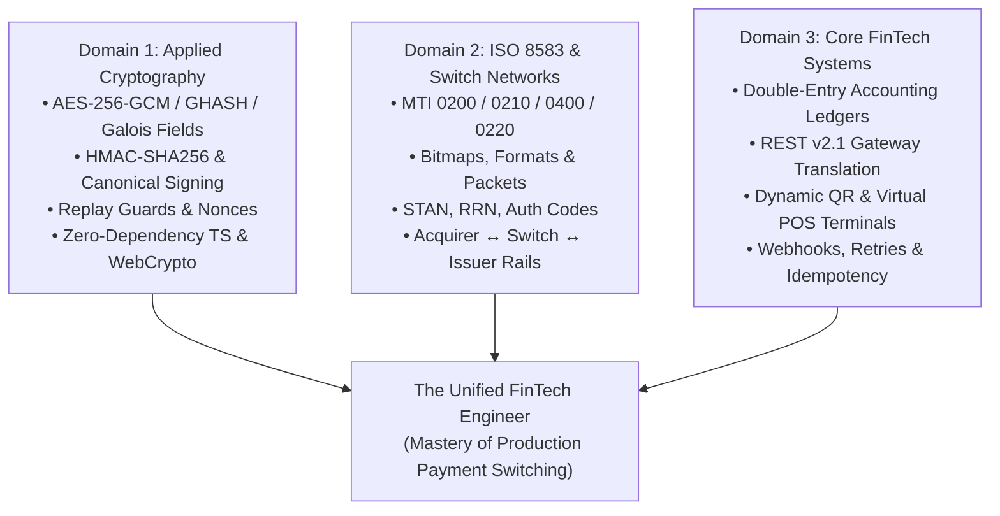

# 🎓 Master Curriculum & Study Guide: Applied Web Cryptography, ISO 8583 Financial Switches & FinTech Gateway Engineering

**Document Identifier:** `begin_master_study.md`  
**Target Audience:** FinTech Engineers, Banking Systems Architects, Payment Gateway Developers, Cryptography Practitioners  
**Scope:** Applied Client/Server Cryptography (AES-GCM, HMAC, PKI), ISO 8583:1987/1993 Core Switching, Payment Gateway Architecture, Double-Entry Ledgers, and POS/Cashier Engineering  
**Author:** Antigravity AI Senior FinTech & Cryptography Engineering Lead  
**Date:** September 19, 2026  

---

## 🧭 Roadmap Overview

Mastering systems like **SukiPay Client** and **Kirara Gateway Server** requires cross-disciplinary mastery across three intersecting domains:



This guide provides the authoritative textbooks, international standards, curated web resources, hands-on lab exercises, and a structured **12-Week Syllabus** to take you from foundational concepts to production-grade payment architecture.

---

## 📚 Part 1: The Curated Master Bookshelf (Definitive Textbooks)

### Category A: Applied Cryptography for Web & Systems

1. **"Serious Cryptography: A Practical Introduction to Modern Encryption"**  
   *Author:* Jean-Philippe Aumasson  
   *Why Read It:* The single best, most accessible, yet mathematically rigorous guide for software developers. Chapters 3 & 4 (Block Ciphers & Modes) and Chapter 8 (Authenticated Encryption) detail AES, Galois/Counter Mode (GCM), GHASH polynomial multiplication over $\text{GF}(2^{128})$, and the catastrophic risks of IV reuse.  
   *Essential Chapters:* Ch. 3 (Block Ciphers), Ch. 4 (Stream Ciphers), Ch. 7 (Hash Functions), Ch. 8 (Authenticated Encryption).

2. **"Cryptography Engineering: Design Principles and Practical Applications"**  
   *Authors:* Niels Ferguson, Bruce Schneier, Tadayoshi Kohno  
   *Why Read It:* Focuses on real-world engineering pitfalls—how cipher modes fail, secure PRNG design, side-channel attacks, clock drift risks, and why "never rolling your own crypto in production without formal audits" is the golden rule.  
   *Essential Chapters:* Ch. 4 (Block Cipher Modes), Ch. 5 (Hash Functions), Ch. 6 (Message Authentication Codes), Ch. 9 (Generating Randomness).

3. **"Bulletproof TLS and PKI: Understanding and Deploying SSL/TLS and PKI to Secure the Internet"**  
   *Author:* Ivan Ristić  
   *Why Read It:* Comprehensive coverage of transport security, cryptographic suites, certificates, and HTTP wire security essential for secure payment transport.

---

### Category B: Payment Systems, ISO 8583 & Financial Switching

4. **"Payment Systems in the Global Economy: Technical Infrastructure, Risks, and Legal Frameworks"**  
   *Author:* Maxwell Stamp / World Bank Publications  
   *Why Read It:* High-level context of retail payment switches, national clearing houses (ACH), settlement mechanisms (RTGS), and card association rails (Visa, Mastercard, China UnionPay).

5. **"ISO 8583: Financial Transaction Card Originated Messages — Interchange Message Specifications" (Parts 1, 2 & 3)**  
   *Publisher:* International Organization for Standardization (ISO)  
   *Standard Editions:* ISO 8583:1987 (Most widely implemented), ISO 8583:1993, and ISO 8583:2003.  
   *Why Read It:* The official bible of electronic funds transfer (EFT). Defines every MTI nibble, the 64-bit primary and 128-bit secondary bitmap, and the exact syntax and semantics of Data Elements 1 through 128.

6. **"EMV Book 1–4: Integrated Circuit Card Specifications for Payment Systems"**  
   *Publisher:* EMVCo (Available free at emvco.com)  
   *Why Read It:* Explains how chip cards communicate with POS terminals (APDU commands), how PIN blocks (ISO 9564) and Data Element 55 (ICC TLV Tags) are generated during contactless and contact card dips.

---

### Category C: FinTech Architecture, Accounting & Ledgers

7. **"Designing Data-Intensive Applications"**  
   *Author:* Martin Kleppmann  
   *Why Read It:* FinTech systems require bulletproof consistency. Kleppmann’s explanations of ACID transactions, distributed consensus, write-ahead logs, idempotency, and partition tolerance are vital when building double-entry accounting databases and switch engines.  
   *Essential Chapters:* Ch. 7 (Transactions), Ch. 9 (Consistency and Consensus), Ch. 11 (Stream Processing).

8. **"Double-Entry Bookkeeping for Developers"** (Articles & Whitepapers by Martin Fowler and Modern Treasury)  
   *Why Read It:* Financial engines do not update balances with simple arithmetic; they append immutable debit/credit entries to an append-only ledger. Learn why double-entry bookkeeping guarantees ledger reconcilability.

---

## 🌐 Part 2: Authoritative Standards, RFCs & Online Resources

### 1. Cryptographic Standards (NIST & IETF)
* **[NIST SP 800-38D](https://csrc.nist.gov/publications/detail/sp/800-38d/final)**: *Recommendation for Block Cipher Modes of Operation: Galois/Counter Mode (GCM) and GMAC.*  
  *Focus:* The mathematical specification behind the GCM mode implemented in `crypto-engine.ts` and `kirara-server`. Pay close attention to Section 5.2 (GHASH) and Section 8 (Uniqueness of IVs).
* **[RFC 2104](https://datatracker.ietf.org/doc/html/rfc2104)**: *HMAC: Keyed-Hashing for Message Authentication.*  
  *Focus:* Inner and outer hash pads (`ipad` and `opad`), secret key truncation, and length extension resistance.
* **[RFC 7519](https://datatracker.ietf.org/doc/html/rfc7519)**: *JSON Web Token (JWT).*  
  *Focus:* HS256 claims, exp timestamps, cryptographic signature verification.
* **[W3C Web Cryptography API Specification](https://www.w3.org/TR/WebCryptoAPI/)**:  
  *Focus:* `crypto.subtle.encrypt`, `crypto.subtle.importKey`, and why WebCrypto requires secure contexts (HTTPS).

### 2. ISO 8583 Specifications & Open-Source Implementations
* **[jPOS Project & Programmer's Guide](http://jpos.org/doc/jPOS-Programmers-Guide.pdf)**:  
  *Focus:* The world's most famous open-source Java ISO 8583 financial switch framework. Its free online guide is the best tutorial on packagers, channel adapters, filters, and transaction managers in existence.
* **[ISO 8583 Bitmap & Field Reference Table](https://en.wikipedia.org/wiki/ISO_8583)**:  
  *Focus:* Quick-lookup cheat sheet for MTIs, bitmasks, and field definitions.
* **[OpenAPI CoalaPay REST v2.1 Specification](https://access.coalapay.cn/tools/v2/index.html)**:  
  *Focus:* The actual commercial specification that Kirara Server and Passway mirror.

### 3. FinTech Engineering Blogs & High-Scale Systems
* **[Stripe Engineering Blog](https://stripe.com/blog/engineering)**: Seminal articles on designing idempotent APIs, distributed transaction coordination, and managing financial ledger systems.
* **[Modern Treasury Journal](https://www.moderntreasury.com/journal)**: In-depth articles on ledger design, clearing rails (ACH, FedNow, Wire), and ledger reconciliation.
* **[FormatP / Payments Culture](https://www.paymentsculture.com/)**: Practical payment industry analysis covering card acquirers, gateways, and switch topologies.

---

## 🗓️ Part 3: The 12-Week Mastery Syllabus

```
Phase 1: Cryptographic Foundations (Weeks 1–4)
Phase 2: ISO 8583 Protocol & Financial Switching (Weeks 5–8)
Phase 3: Gateway Integration, POS & Ledger Architecture (Weeks 9–12)
```

---

### Phase 1: Cryptographic Foundations (Weeks 1–4)

#### Week 1: Block Ciphers, AES & Galois Counter Mode (GCM)
* **Core Topics:**
  * Substitution-Permutation Networks, S-Boxes, ShiftRows, MixColumns, Round Keys.
  * Cipher modes: ECB (insecure), CBC (padding oracle vulnerabilities), CTR (counter mode).
  * Galois/Counter Mode (GCM): Authenticated Encryption with Associated Data (AEAD).
  * Polynomial arithmetic in $\text{GF}(2^{128})$ with reduction polynomial $R = x^{128} + x^7 + x^2 + x + 1$ (`0xE1`).
  * The IV reuse catastrophe: why repeating a 12-byte IV under the same AES key completely compromises the authentication key $H$.
* **Reading:**
  * *Serious Cryptography*, Chapters 3, 4 & 8.
  * NIST SP 800-38D (Sections 5 & 8).
* **Hands-on Lab:**
  * Open [`sukiGatewayClient/src/crypto/crypto-engine.ts`](file:///home/cyrus/Projects/API_Projects/sukiGatewayClient/src/crypto/crypto-engine.ts).
  * Trace the `ghash()` method and the `gctr()` counter transformation. Write a unit test that verifies a known NIST AES-GCM test vector (KAT).

#### Week 2: Hashing, Message Authentication (HMAC) & Canonical Strings
* **Core Topics:**
  * Merkle-Damgård hash construction (SHA-256) and Length Extension Attacks.
  * HMAC construction: $\text{HMAC}(K, m) = H((K \oplus \text{opad}) \parallel H((K \oplus \text{ipad}) \parallel m))$.
  * Canonical string formatting: why query parameter sorting, strict trimming, and delimiter encoding are necessary to avoid signature mismatches.
* **Reading:**
  * *Serious Cryptography*, Chapter 7.
  * RFC 2104.
* **Hands-on Lab:**
  * Compare the pure TypeScript HMAC implementation in `crypto-engine.ts` with Node.js native `crypto.createHmac('sha256')` in `kirara-server/src/crypto/hmac-signer.ts`.
  * Verify canonical signing with edge cases (empty strings, special characters, timestamp boundaries).

#### Week 3: Transport Security, Handshakes & Replay Defense
* **Core Topics:**
  * Web Cryptography API (`window.crypto.subtle`) vs. Native OpenSSL vs. Pure Software Engines.
  * Nonce generation, entropy sources (`crypto.getRandomValues`).
  * Replay attacks: Packet capture, replay windows, timestamp clock-drift mitigation ($\le 300$ seconds).
  * JWT Architecture: Headers, payloads, base64url encoding, HS256 vs. RS256/Ed25519 signing.
* **Reading:**
  * *Cryptography Engineering*, Chapters 6 & 9.
  * RFC 7519 (JWT).
* **Hands-on Lab:**
  * Inspect `kirara-server/src/middleware/replay-guard.ts`. Modify the nonce cache to simulate a captured replay packet and verify that Kirara rejects it with HTTP 400.

#### Week 4: Cryptographic Toolbox & Code Exporter Engineering
* **Core Topics:**
  * Cross-language cryptographic portability: Porting AES-256-GCM and HMAC-SHA256 across TypeScript, Python (`cryptography`), Java (`javax.crypto.Cipher`), and cURL.
  * Constant-time comparison to prevent timing attacks.
* **Reading:**
  * *Serious Cryptography*, Chapter 14 (Crypto Implementations & Pitfalls).
* **Hands-on Lab:**
  * Open `sukiGatewayClient/src/components/CryptoToolbox.tsx` and `src/services/code-generator.ts`.
  * Run the generated Python and Java snippets against Kirara Gateway Server and verify that they authenticate and decrypt cleanly.

---

### Phase 2: ISO 8583 Protocol & Financial Switching (Weeks 5–8)

#### Week 5: ISO 8583 Anatomy, MTI & Bitmaps
* **Core Topics:**
  * Structure of an ISO 8583 message: Header, Message Type Identifier (MTI), Bitmaps, Data Elements.
  * Decoding MTIs:
    * 1st digit: Version (0 = 1987, 1 = 1993, 2 = 2003).
    * 2nd digit: Message Class (1 = Auth, 2 = Financial, 4 = Reversal, 8 = Network Mgmt).
    * 3rd digit: Message Function (0 = Request, 1 = Response, 2 = Advice, 3 = Advice Response).
    * 4th digit: Message Originator (0 = Acquirer, 1 = Acquirer Repeat, 2 = Issuer).
  * Primary Bitmap (Bits 1–64) vs. Secondary Bitmap (Bits 65–128). Hexadecimal packing and bitmask testing.
* **Reading:**
  * Wikipedia & jPOS Programmer’s Guide (Chapter 2: "ISO 8583 Basics").
* **Hands-on Lab:**
  * Take a raw HEX packet from `sukiGatewayClient/src/components/SwitchInspector.tsx` (e.g., `02007020000000000000...`).
  * Decode it manually on paper: convert the first 16 hex characters of the bitmap into binary and list which Data Elements are active.

#### Week 6: Core Financial Data Elements & Encoding Schemes
* **Core Topics:**
  * Field data types: Fixed length (e.g. `n 6`, `an 12`) vs. Variable length (`LLVAR`, `LLLVAR`).
  * Character encoding: ASCII vs. EBCDIC vs. Binary Coded Decimal (BCD).
  * Detailed study of critical fields:
    * DE 2 (PAN), DE 3 (Processing Code: 6 digits - Transaction / From Account / To Account).
    * DE 4 (Amount), DE 11 (STAN sequence generation), DE 37 (RRN generation algorithm).
    * DE 38 (Auth Code), DE 39 (Response Codes: `00` Approved, `05` Do Not Honor, `51` Insufficient Funds).
    * DE 49 (ISO 4217 Currency Codes).
* **Reading:**
  * ISO 8583:1987 Specification, Data Element Directory.
* **Hands-on Lab:**
  * Review `kirara-server/src/services/order.store.ts` (`recordIsoSwitch` method).
  * Implement Julian day-of-year calculation and STAN rollover logic.

#### Week 7: Financial Switch Workflows: Presentment, Auth, Void & Refund
* **Core Topics:**
  * Dual-message vs. Single-message systems (Auth + Settlement vs. Instant Purchase).
  * MTI 0200 (Purchase presentment) $\rightarrow$ MTI 0210 (Authorization approval).
  * Financial Reversals (MTI 0400 / 0420): Why network timeouts or operator voids must initiate immediate reversals to release customer balance holds.
  * Financial Advice (MTI 0220): Offline approvals and merchant-initiated refunds.
* **Reading:**
  * *Payment Systems in the Global Economy*, Chapters on Clearing and Settlement.
* **Hands-on Lab:**
  * In `sukiGatewayClient`, submit an order, execute a cancellation, and perform a refund.
  * In `SwitchInspector.tsx`, verify that the MTI sequences match `0200` $\rightarrow$ `0210` $\rightarrow$ `0400` $\rightarrow$ `0220`.

#### Week 8: Connecting REST Gateways to ISO 8583 Switches
* **Core Topics:**
  * Architectural translation layer: REST JSON requests $\longleftrightarrow$ State Machine $\longleftrightarrow$ ISO 8583 Packets.
  * Managing state transitions between synchronous HTTP connections and asynchronous switch message queues.
  * Handling network timeouts, store-and-forward (SAF) queues, and response code mapping.
* **Reading:**
  * jPOS Programmer’s Guide (Chapter 6: "Transaction Manager & Space Architecture").
* **Hands-on Lab:**
  * Trace the flow in `kirara-server/src/routes/order.routes.ts` through to `order.store.ts` and `iso8583_logs`. Write an integration test validating that creating an order produces a valid database record in `iso8583_logs`.

---

### Phase 3: Gateway Integration, POS & Ledger Architecture (Weeks 9–12)

#### Week 9: Double-Entry Ledgers & Atomic Financial Persistence
* **Core Topics:**
  * Why mutating row balances directly (`UPDATE accounts SET balance = balance + 10`) causes silent accounting discrepancies and race conditions.
  * Double-Entry Bookkeeping: Debits must equal Credits for every economic transaction.
  * Append-only ledger design in MariaDB/MySQL: Transaction isolation levels (`READ COMMITTED` vs. `SERIALIZABLE`), optimistic locking, write-ahead logs.
* **Reading:**
  * *Designing Data-Intensive Applications*, Chapter 7 (Transactions).
  * Martin Fowler: "Accounting Patterns" (martinfowler.com/eaaDev/AccountingNarrative.html).
* **Hands-on Lab:**
  * Inspect `kirara-server/src/db/database.ts` and the schema in `mariDB_Setup.md`.
  * Write a SQL script that verifies the total settled order amount against the total processed refund amounts to confirm zero balance drift.

#### Week 10: Cashier Architecture: Dynamic QR, Hosted Checkouts & POS Simulation
* **Core Topics:**
  * EMVCo QR Code standard (Merchant-Presented QR vs. Consumer-Presented QR).
  * Hosted Cashier security: Clickjacking defense, CSP (Content Security Policy) headers, postMessage iframe isolation.
  * Simulating Point-of-Sale (POS) terminals: Virtual EMV card presets, CVV/Expiry verification, contact chip vs. contactless NFC presentment.
* **Reading:**
  * EMVCo Merchant-Presented QR Code Specification (emvco.com).
* **Hands-on Lab:**
  * Open `sukiGatewayClient/src/components/CashierSimulatorModal.tsx`.
  * Add a new test card preset (e.g. Discover / UnionPay card) with automated Luhn algorithm validation.

#### Week 11: Asynchronous Webhooks, Idempotency & Delivery Guarantees
* **Core Topics:**
  * Webhook reliability: Exactly-once vs. At-least-once delivery semantics.
  * Non-blocking dispatchers using Node.js event loops (`setImmediate`) or message queues (BullMQ, RabbitMQ, Kafka).
  * Exponential backoff, jitter, and dead-letter queues.
  * Merchant-side idempotency keys: preventing duplicate fulfillment when webhooks are retried.
* **Reading:**
  * Stripe Engineering: "Designing robust and predictable APIs with idempotency".
* **Hands-on Lab:**
  * Review `kirara-server/src/services/webhook.dispatcher.ts`.
  * Configure an artificial endpoint that returns HTTP 500 on the first attempt and HTTP 200 on retry. Verify that the dispatcher attempts retry #2 and logs the outcome.

#### Week 12: Production Hardening, PCI-DSS & High-Availability Operations
* **Core Topics:**
  * PCI-DSS 4.0: Scoping, PAN tokenization, data retention rules, HSMs (Hardware Security Modules: Thales, Futurex, CloudHSM).
  * High-Availability Architecture: Multi-zone deployment, database connection pooling, sub-1ms distributed caching (Redis/Valkey), zero-downtime rolling upgrades.
  * Real-time metrics and financial alerting: TPS tracking, authorization rate anomalies, latency spikes.
* **Reading:**
  * PCI-DSS 4.0 Quick Reference Guide (pcisecuritystandards.org).
  * Review `gatewayPay_info.md` (Section 4: Production Enterprise Banking Environment).
* **Capstone Project:**
  * Deploy `kirara-server` and `sukiGatewayClient` under production configurations; simulate 1,000 transactions; verify MariaDB ledger integrity and zero dropped switch packets.

---

## 🛠️ Part 4: Hands-On Lab Exercises (Using SukiPay & Kirara)

To cement your theoretical learning, execute these four hands-on labs directly in your workspace:

### Lab 1: Zero-Dependency Cryptographic Verification
* **Goal:** Verify that client and server derive identical ciphertext and HMAC signatures.
* **Steps:**
  1. Open `sukiGatewayClient` in your browser (`npm run dev`).
  2. Navigate to the **Crypto Toolbox** tab.
  3. Enter a test message: `{"orderId": "LAB-001", "amount": "100.00"}`.
  4. Encrypt it using the default Kirara App Key.
  5. Copy the generated uppercase hex and verify that Kirara’s native backend decrypts it without errors.

### Lab 2: Live ISO 8583 Packet Decomposition
* **Goal:** Trace an order from REST creation to raw ISO hex packet.
* **Steps:**
  1. Open the **Payment Operations** console.
  2. Submit a $25.00 order.
  3. Navigate to the **ISO 8583 Switch** tab.
  4. Select the newest transaction. Review the decoded fields: DE 2 (PAN), DE 3 (ProcCode `000000`), DE 4 (`000000002500`), DE 11 (STAN), and DE 37 (RRN).
  5. Inspect the **Raw ISO Hex** string and map the characters back to the parsed table.

### Lab 3: Terminal POS Decline & Reversal Simulation
* **Goal:** Understand non-happy-path financial routing.
* **Steps:**
  1. Create an order for $99.00.
  2. Launch the **Embedded Virtual POS Terminal**.
  3. Select the **Decline Test Card** (`4000********0002`).
  4. Settle the payment and observe the transition to `FAILED`.
  5. In the ISO 8583 Switch tab, observe the response packet carrying **DE 39 = `05` (Do Not Honor)**.

### Lab 4: Multi-Language Integration Validation
* **Goal:** Experience the merchant developer onboarding journey.
* **Steps:**
  1. In the Payment Console, click the **Code** icon on any completed transaction.
  2. Switch between **TypeScript**, **Python**, **Java**, and **cURL**.
  3. Run the Python snippet from your terminal using `python3` with `requests` and `cryptography` installed. Confirm that it executes against Kirara on port 8080 and returns HTTP 200.

---

## 📋 Part 5: Self-Assessment Skills Checklist

Before considering yourself proficient, you should be able to answer **YES** to every checkpoint below:

### Cryptography & Security
- [ ] Can I explain why AES-GCM requires a unique IV for every message and what happens mathematically if an IV is reused?
- [ ] Can I explain the difference between Galois field arithmetic ($\text{GF}(2^{128})$) in GHASH and standard integer arithmetic?
- [ ] Can I construct an HMAC canonical query string from scratch and explain why parameter order and encoding matter?
- [ ] Can I explain how a Replay Guard works using nonces and timestamp drift validation?
- [ ] Do I know why WebCrypto API requires a secure context (HTTPS) and how a pure TypeScript fallback operates?

### ISO 8583 & Financial Switching
- [ ] Can I decode an MTI like `0200`, `0210`, `0400`, or `0220` without consulting documentation?
- [ ] Can I convert a 16-hex character primary bitmap into a 64-bit binary string and identify which fields are present?
- [ ] Do I understand the purpose of STAN (DE 11) and RRN (DE 37) and how they relate to reconciliation?
- [ ] Can I explain the difference between a reversal (MTI 0400) and a refund (MTI 0220)?
- [ ] Do I know what fields are mandatory in a purchase authorization request vs. a reversal?

### FinTech Architecture & Systems
- [ ] Can I explain why financial systems must use append-only double-entry ledgers instead of mutating table balances?
- [ ] Do I understand how to design idempotent webhook dispatchers with exponential backoff?
- [ ] Can I design an embedded POS simulator that emulates EMV chip / contactless card authorization?
- [ ] Do I know what PCI-DSS requires regarding PAN masking (first 6, last 4) and encryption at rest?

---

*Keep this study guide accessible as you develop, test, and expand SukiPay Client and Kirara Gateway Server.*
