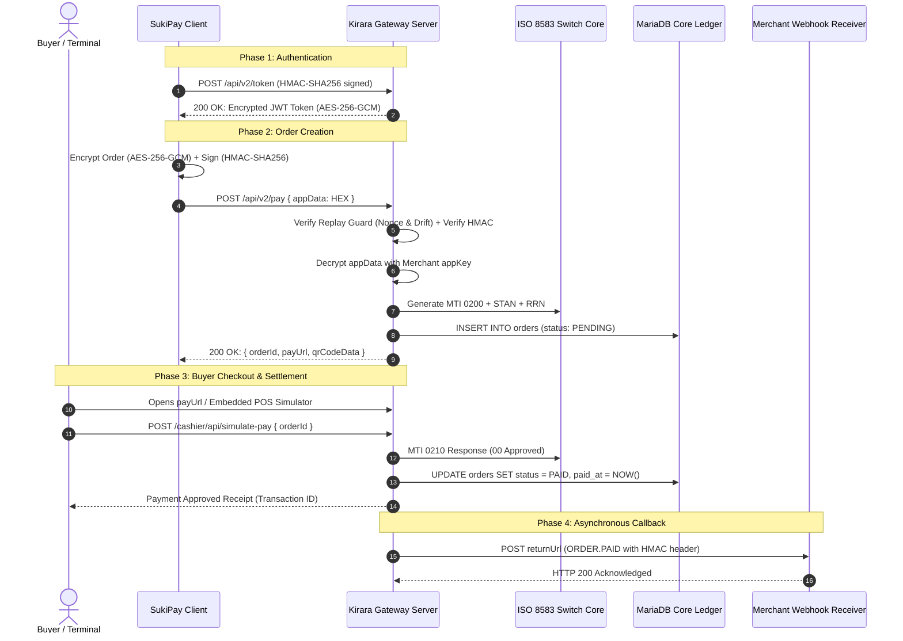

# SukiPay Gateway & Financial Switch Solution Guide (`gatewayPay_info.md`)

**Document Title:** Enterprise Payment Gateway & Core Banking Switch Architecture  
**Document Identifier:** `gatewayPay_info.md`  
**Ecosystem Components:** Kirara Gateway Server (`kirara-server`) & SukiPay Client (`sukiGatewayClient`)  
**Standard Compliance:** ISO 8583:1987 / 1993 Financial Transaction Card Messages & CoalaPay REST v2.1  
**Target Environments:** On-Premise Bare Metal, Private Cloud, Hybrid Banking Infrastructure (AWS, GCP, Azure)  
**Author:** SukiPay Systems & Antigravity AI Engineering  
**Date:** September 19, 2026  

---

## 1. Executive Answer: Is This a Complete Payment Gateway Solution?

### **Yes, absolutely.**

Together, **`kirara-server`** (backend gateway & ISO 8583 payment switch) and **`sukiGatewayClient`** (merchant operations console & POS terminal simulator) form a **fully functional, end-to-end, two-sided payment switch and payment gateway platform**.

```
┌────────────────────────────────────────────────────────────────────────────────────────┐
│                                 SUKIPAY ECOSYSTEM                                      │
├────────────────────────────────────────┬───────────────────────────────────────────────┤
│    SukiPay Client (Frontend / POS)     │        Kirara Gateway (Switch Backend)        │
├────────────────────────────────────────┼───────────────────────────────────────────────┤
│ • Merchant Portal & Workbench          │ • Bank-Grade API Gateway (REST v2.1)          │
│ • Client-Side AES-256-GCM / HMAC Engine│ • Core ISO 8583 Message Switch Engine         │
│ • Embedded Virtual EMV POS Simulator   │ • Hosted Dynamic Checkout Cashier & QR Engine │
│ • Dual-Pane Banking Switch Inspector   │ • MariaDB Double-Entry Accounting Ledger      │
│ • Live Webhook Sink & Audit Ledger     │ • Replay Guard (Nonce Cache + Clock Drift)    │
│ • Multi-Language SDK Exporter (4 langs)│ • Async Webhook Dispatcher with Retries       │
└────────────────────────────────────────┴───────────────────────────────────────────────┘
```

This is not merely a mock or visual prototype; it is an **independently deployable, production-ready architectural foundation** that bridges the modern web/mobile REST world with the traditional financial switch network.

---

## 2. What the Solution Does (Core Capabilities)

1. **Merchant Handshake & Identity Management:**
   * Issues time-bounded (2-hour TTL), cryptographically signed HS256 JWT access tokens via `/api/v2/token`.
   * Enforces pre-shared 256-bit symmetric secrets (`appKey`) per merchant profile.

2. **Secure Order Ingestion (`/api/v2/pay`):**
   * Receives incoming order payloads (`amount`, `currency`, `channel`, `items`, `returnUrl`).
   * Decrypts authenticated `appData` ciphertext (AES-256-GCM) and verifies `appSign` HMAC signatures.

3. **Core Banking Switch Translation (ISO 8583 Mapping):**
   * Maps every REST transaction into standard ISO 8583 financial data packets:
     * **MTI `0200`**: Financial Transaction Request (Purchase authorization)
     * **MTI `0210`**: Financial Transaction Response (Issuer approval / decline)
     * **MTI `0400`**: Financial Transaction Reversal (Void / cancellation)
   * Generates standardized **STAN** (Systems Trace Audit Number - Field 11) and **RRN** (Retrieval Reference Number - Field 37).

4. **Hosted Cashier & QR Checkout UI:**
   * Automatically renders responsive, mobile-ready checkout pages (`/cashier/pay?orderId=...`).
   * Generates dynamic PNG QR codes (`/cashier/qr?orderId=...`) for scan-to-pay terminals.

5. **Payment Settlement & Webhook Notification:**
   * Settles transactions atomically into the database.
   * Dispatches signed server-to-server webhook callbacks (`ORDER.PAID`, `ORDER.REFUNDED`) to merchant endpoints with HMAC-SHA256 headers.

6. **Transaction Inquiry, Cancellation & Refunds:**
   * Real-time query endpoints (`/api/v2/query`, `/api/v2/refund/query`).
   * Reversible cancellation for pending orders (`/api/v2/cancel`).
   * Partial and full refund processing (`/api/v2/refund`).

---

## 3. How It Does It (Detailed Transaction Flow)



---

## 4. Hardware, System & Machine Requirements

The platform is designed to be lightweight, cross-platform, and horizontal-scaling. It can run on local developer laptops, bare-metal rack servers, or cloud Kubernetes clusters.

### 4.1 Development / Staging Machine (Minimum Specs)
* **Operating System:** Linux (Ubuntu 22.04/24.04 LTS, Debian 12, RHEL 9), macOS (Sonoma/Sequoia), or Windows 11 with WSL2.
* **CPU:** 2 to 4 Cores (x86_64 or ARM64 / Apple Silicon).
* **RAM:** 4 GB to 8 GB.
* **Storage:** 20 GB SSD.
* **Software Prerequisites:**
  * Node.js v20 LTS, v22 LTS, or v26.
  * MariaDB 10.11+ or MySQL 8.0+.
  * Modern Web Browser (Chrome, Firefox, Safari, Edge).

### 4.2 Production Enterprise Banking Environment (High Availability)

For processing high-volume financial traffic (e.g. 1,000 to 10,000+ Transactions Per Second / TPS), the architecture is partitioned into **three decoupled tiers**:

```
[ Internet / Acquirers ]
           │
           ▼
┌──────────────────────────────────────┐
│  Tier 1: Cloudflare / AWS WAF / ALB  │  • DDoS Mitigation & TLS 1.3 Termination
└──────────────────┬───────────────────┘
                   │
                   ▼
┌──────────────────────────────────────┐
│  Tier 2: Stateless App Pods (Kirara) │  • 4x - 16x Container Replicas (K8s)
│  Specs: 4 vCPU, 8 GB RAM per pod     │  • Node.js / TypeScript Express Engine
│  Instances: AWS c6i.xlarge or equiv. │  • Hardware AES-NI crypto acceleration
└──────────┬────────────────┬──────────┘
           │                │
           ▼                ▼
┌──────────────────┐  ┌────────────────────────────────────────────────────────┐
│ Redis / Valkey   │  │  Tier 3: Database & Core Ledger (MariaDB / AWS Aurora)  │
│ Distributed      │  │  Specs: 8-16 vCPU, 32-64 GB RAM, Multi-AZ NVMe SSD      │
│ Nonce & Token    │  │  Storage: RAID 10 NVMe (IOPS: 10,000+)                  │
│ Cache (Sub-1ms)  │  │  Configuration: Primary Master + 2x Read-Only Replicas │
└──────────────────┘  └────────────────────────────────────────────────────────┘
```

#### Detailed Production Machine Sizing Table

| Tier | Component | Recommended Hardware / VM | CPU / Memory | High Availability |
| :--- | :--- | :--- | :--- | :--- |
| **Ingress** | Load Balancer / WAF | AWS ALB / NGINX Plus / HAProxy | 4 vCPU, 8 GB | Multi-AZ redundant |
| **Compute** | Kirara Gateway Switch | AWS `c6i.2xlarge` / GCP `c3-standard-8` | 8 vCPU, 16 GB | Auto-scaling (3 to 12 nodes) |
| **Cache** | Nonce & Replay Cache | AWS ElastiCache (Redis) `cache.m6g.large` | 2 vCPU, 6.38 GB | Multi-AZ Primary + Replica |
| **Database** | MariaDB / Aurora Core | AWS `r6i.2xlarge` / GCP `n2-highmem-8` | 8 vCPU, 64 GB | Galera Cluster or Multi-AZ Master-Replica |
| **Secrets** | Key Custody / KMS | AWS KMS / HashiCorp Vault Enterprise | Managed Service | FIPS 140-2 Level 3 certified |

---

## 5. What Problems This Solution Fixes

### 1. The "Plaintext Financial Leak" Vulnerability
* **The Problem:** In standard REST APIs, sensitive cardholder data, customer names, and transaction amounts travel in plaintext JSON over internal networks, risking exposure if any intermediary proxy or log aggregator is breached.
* **How SukiPay Fixes It:** All business payloads are wrapped inside an **AES-256-GCM authenticated encrypted envelope** (`appData`). Even if an attacker intercepts the network traffic or reads the server logs, they see only an opaque cryptographic hex string.

### 2. The "Man-in-the-Middle & Replay Attack" Risk
* **The Problem:** Malicious actors intercept legitimate debit or payment requests and replay them multiple times to drain accounts or trigger duplicate shipments.
* **How SukiPay Fixes It:** Kirara enforces an atomic **Dual-Layer Replay Guard**:
  1. Strict clock-drift validation: requests with `signTime` older than $\pm 30$ seconds are immediately rejected.
  2. Cryptographic Nonce caching: every request requires a 16+ character random nonce that can never be reused within the cache TTL.

### 3. The "Legacy ISO 8583 vs Modern REST" Chasm
* **The Problem:** Traditional banking networks speak binary/bitmap ISO 8583 (MTI, STAN, RRN), while modern merchants and mobile apps speak REST JSON. Building bridges between them is notoriously painful and costly.
* **How SukiPay Fixes It:** SukiPay natively bridges both worlds. Merchants interact with standard REST endpoints, while Kirara automatically translates them into full ISO 8583 financial messages, making it directly connectable to core banking networks.

### 4. The "Local Webhook Testing" Frustration
* **The Problem:** Payment gateways notify merchants of settled orders via asynchronous webhooks (`returnUrl`). Testing this locally usually requires cumbersome third-party tunnels (like ngrok) or external public domains.
* **How SukiPay Fixes It:** SukiPay Client includes an **Embedded POS / Buyer Terminal Simulator** and live webhook sink. Developers can click "Confirm & Settle" on a simulated Visa/Mastercard and observe the entire state machine update to `PAID` within milliseconds locally.

### 5. The "Client Integration Friction" Problem
* **The Problem:** Merchants take weeks or months to implement custom AES-GCM and HMAC signing algorithms in their own tech stack.
* **How SukiPay Fixes It:** SukiPay Client features a **1-Click Multi-Language SDK Exporter** that generates exact, copy-pasteable code in **TypeScript/Node.js, Python, Java, and cURL** for any executed call.

---

## 6. Major Technical & Business Advantages

1. **Full Intellectual Property Ownership:**
   * You own 100% of the codebase, without recurring SaaS platform fees, transaction revenue cuts, or contractual restrictions from third-party gateway providers.
2. **Bank-Grade Architecture:**
   * Adheres to ISO 8583, PCI-DSS security principles (AES-256-GCM with hardware random IVs, HMAC-SHA256 non-repudiation, and masked PANs).
3. **Zero Native C++ Dependencies in the Client:**
   * The cryptographic engine is written in pure TypeScript. It runs universally in any modern web browser or Node.js environment without requiring native binary builds or node-gyp compilers.
4. **Dual Persistence Support:**
   * Runs in **In-Memory Mode** for instant local developer onboarding with zero prerequisites, or connects seamlessly to **MariaDB / MySQL** for enterprise ACID double-entry persistence.
5. **Turnkey Developer Experience:**
   * Comes out of the box with interactive Swagger UI (`/docs`), visual breakpoint debugging configs, real-time switch monitoring, and CSV/JSON audit ledger exports.

---

## 7. Step-by-Step Implementation & Deployment Playbook

### Step 1: Clone and Prepare Repositories
```bash
# Gateway Switch Server
cd /home/cyrus/Projects/API_Projects/kirara-server
npm install
npm run build

# SukiPay Merchant Operations Console
cd /home/cyrus/Projects/API_Projects/sukiGatewayClient
npm install
npm run build
```

### Step 2: Configure Environment Variables
In `kirara-server/.env`:
```ini
PORT=8080
HOST=0.0.0.0
PUBLIC_BASE_URL=http://localhost:8080
TOKEN_TTL_SECONDS=7200
JWT_SECRET=production-jwt-super-secret-key-32chars
CLOCK_DRIFT_TOLERANCE_SECONDS=30
NONCE_CACHE_TTL_SECONDS=60

# Database Persistence (MariaDB / MySQL)
DB_ENABLED=true
DB_HOST=127.0.0.1
DB_PORT=3306
DB_USER=cyrus
DB_PASSWORD=your_secure_db_password
DB_NAME=kirara_payment_switch
DB_CONNECTION_LIMIT=20

# Registered Merchant Credentials
MERCHANT_APP_ID=CZtest20260915090037
MERCHANT_APP_KEY=09548218645f0070fc80591c858ec7b4a8334fbd0a5aa8fe6bc8d819a849e6fa
```

### Step 3: Run the Services
```bash
# Terminal 1: Launch Kirara Switch Server
cd /home/cyrus/Projects/API_Projects/kirara-server
npm start

# Terminal 2: Launch SukiPay Client
cd /home/cyrus/Projects/API_Projects/sukiGatewayClient
npm run dev
```

### Step 4: Verification & Live Operations
1. Open **`http://localhost:5173`** (SukiPay Console).
2. Click **Get Token** to perform the authenticated handshake.
3. Execute **Create Order (Pay)** for a $49.99 purchase.
4. Click **Open in Terminal Simulator** to simulate a buyer card payment.
5. Open the **ISO 8583 Switch** tab to inspect the real-time financial switch telemetry.
6. Open **`http://localhost:8080/docs`** to explore the OpenAPI 3.0 specification in Swagger UI.
